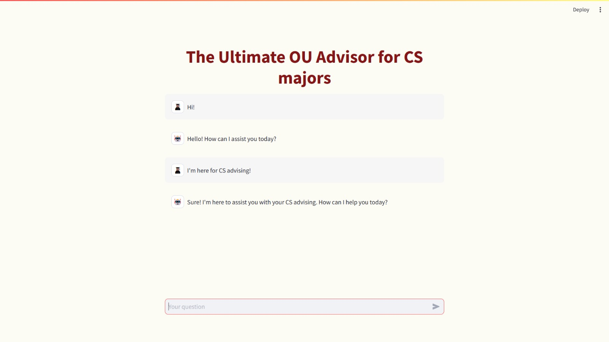

# CS-degree-chatbot

## Chatbot Overview:

## Inspiration:
As CS students at the University of Oklahoma, we aim to create a chatbot that assists students in navigating the complex process of understanding their degree requirements. Given the limited availability of advising appointments, this chatbot will serve as a valuable tool for students planning their enrollment for upcoming semesters.

## What it does:
The chatbot answers users' questions about CS program requirements, covering Major Requirements, Major Support Requirements, and both Technical and CS electives. Additionally, the chatbot can recommend a combination of courses for a semester plan based on the number of credit hours input by the user. The bot is also capable of identifying course prerequisites and providing a detailed description of each course. Finally, it can list courses tailored to a student's academic standing, whether they are a freshman, sophomore, junior, or senior.

## How we built it:
We scraped the OU CS degree requirements web pages to gather data essential for fine-tuning the OpenAI GPT-3.5 Turbo model. This data was then formatted into .txt files. In essence, we embedded our own knowledge base into the existing model to enhance its capabilities. Utilizing the Llama Index data framework, we imported the data from the .txt files, parsed them into nodes, and constructed an index for efficient model querying. Additionally, we provided the model with a detailed prompt that instructs it on interpreting user input, ensuring accurate responses. While Python powers our backend, we employed Streamlit—a modern Python library—for frontend development, leveraging Streamlit's custom component elements. Lastly, in conjunction with GPT-3.5 Turbo, we used LlamaIndex to create a context-based engine that discerns user inputs unrelated to the CS course model.

## Challenges we ran into:
We initially envisioned a chatbot that could generate enrollment plans based on completed courses and also suggest courses for popular minors, like mathematics and business, which CS students frequently pursue. However, given the constraints of time and our novice experience with new technologies, we decided to concentrate on the CS degree requirements. This specificity allowed us to fine-tune the model with greater precision and provide it with a detailed prompt. Additionally, the manageable size of the collected data aided us in debugging the chatbot's responses, as we could manually verify the accuracy of its answers.

## Accomplishments that we're proud of:
We take great pride in our brainstorming process and in selecting a topic that's both practical and resonant for CS students. Additionally, we're thrilled with our ability to learn and implement new libraries and frameworks with which we had no prior experience, including Streamlit and LlamaIndex

## Ethics and Bias Consideration:
Ethics Evaluation: Our design aims to ensure that users are not negatively impacted, and we believe there are no inherent harms associated with its use. However, we strongly encourage users to attend advising sessions and discuss their enrollment plans with their advisors. Our design is intended to serve as supplementary support, providing clarity and guidance to users.

Bias Consideration: Our current design is specifically tailored for students who are progressing at the standard pace of their degree program. To make our system more inclusive and cater to a broader audience, we recognize the potential need to address biases. We could refine our design to account for students who may drop out and later re-enroll, students who don't achieve passing grades in their courses, and those who have completed certain credits during high school. While this will add complexity to our code, it will ensure our chatbot serves a wider range of student experiences and backgrounds.

## What's next for CS Advising Chatbot:
In future iterations, we aim to enhance the AI's capabilities to recommend courses for minors that CS students frequently pursue, such as mathematics and business. Additionally, we envision expanding the chatbot's scope to encompass other engineering majors, ensuring they too benefit from its functionalities.

